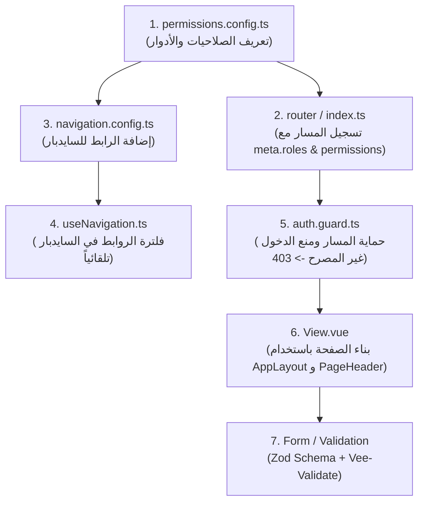

# دليل شامل: كيفية إضافة مسار جديد (Route) مع الصلاحيات والـ Validation في NASAQ LMS

هذا الدليل يشرح بالتفصيل خطوة بخطوة كيفية إنشاء وإضافة صفحة / مسار جديد في المشروع، مع ربطه بنظام الصلاحيات (RBAC)، السايدبار، والـ Validation.

---

## 🏛️ المخطط العام للمنظومة (Architecture Overview)



---

## 🚀 مثال عملي متكامل: إضافة قسم "الشهادات" (Certificates)

سنقوم بمثال واقعي لإضافة صفحة **الشهادات** (`/certificates`) بحيث تكون متاحة فقط لـ **`ADMIN`** و **`INSTRUCTOR`** مع زر إضافة شهادة جديدة واستمارة بفحص الـ Validation.

---

### الخطوة 1: تعريف الصلاحيات والأدوار (Permissions & Roles)
📍 الملف: `src/core/permissions/permissions.config.ts`

نحدد كود الصلاحية الجديدة ونربطها بالأدوار المصرح لها:

```typescript
export const PERMISSIONS = {
  // ... الصلاحيات الحالية
  CERTIFICATE_MANAGE: 'certificate:manage',
  CERTIFICATE_VIEW: 'certificate:view',
} as const;

export const ROLE_PERMISSIONS: Record<Role, Permission[]> = {
  ADMIN: [
    // يملك كافة الصلاحيات بما فيها
    PERMISSIONS.CERTIFICATE_MANAGE,
    PERMISSIONS.CERTIFICATE_VIEW,
  ],
  INSTRUCTOR: [
    PERMISSIONS.CERTIFICATE_VIEW, // المعلم يستعرض الشهادات فقط
  ],
  STUDENT: [
    // ليس لديه صلاحية إدارة الشهادات
  ],
};
```

---

### الخطوة 2: إضافة أيقونة السايدبار (Icon Component)
📍 المجلد: `src/shared/components/icons/`

1. ننشئ ملف الأيقونة `IconCertificates.vue`:
```vue
<script setup lang="ts">
import type { HTMLAttributes } from 'vue';

interface Props {
  class?: HTMLAttributes['class'];
  size?: number | string;
}
const props = withDefaults(defineProps<Props>(), { size: 20 });
</script>

<template>
  <svg :class="props.class" :width="props.size" :height="props.size" viewBox="0 0 24 24" fill="none" xmlns="http://www.w3.org/2000/svg">
    <path d="M12 15C15.3137 15 18 12.3137 18 9C18 5.68629 15.3137 3 12 3C8.68629 3 6 5.68629 6 9C6 12.3137 8.68629 15 12 15Z" stroke="currentColor" stroke-width="1.8" />
    <path d="M8.21 13.89L7 21L12 18L17 21L15.79 13.88" stroke="currentColor" stroke-width="1.8" stroke-linecap="round" stroke-linejoin="round" />
  </svg>
</template>
```

2. نصدرها في `src/shared/components/icons/index.ts`:
```typescript
export { default as IconCertificates } from './IconCertificates.vue';
```

---

### الخطوة 3: تسجيل المسار في الـ Router مع الحماية الصارمة
📍 الملف: `src/router/index.ts` (أو داخل مجلد الـ feature المعني)

نضيف المسار مع تحديد الـ `meta` التي يقرأها الـ `auth.guard.ts` تلقائياً:

```typescript
{
  path: '/certificates',
  name: 'certificates',
  component: () => import('@features/certificates/views/CertificatesListView.vue'),
  meta: {
    requiresAuth: true,                       // يتطلب تسجيل دخول
    title: 'Certificates',                    // عنوان الصفحة
    roles: [ROLES.ADMIN, ROLES.INSTRUCTOR],   // الأدوار المصرح لها
    permissions: [PERMISSIONS.CERTIFICATE_VIEW], // الصلاحية المطلوبة
  },
}
```

> 🛡️ **كيف تتم الحماية تلقائياً؟**
> عند قيام أي مستخدم بفتح `/certificates`، يقوم `auth.guard.ts` بالتحقق:
> 1. هل المستخدم مسجل دخول؟ (إذا لا -> تحويل لـ `/login?redirect=/certificates`).
> 2. هل رتبة المستخدم (`STUDENT` مثلاً) تملك الصلاحية؟ (إذا لا -> منع فوري وتحويل لـ `/forbidden?from=/certificates`).

---

### الخطوة 4: إضافة الرابط إلى السايدبار (Sidebar Navigation Config)
📍 الملف: `src/core/navigation/navigation.config.ts`

نضيف العنصر في قائمة السايدبار المركزية:

```typescript
import { IconCertificates } from '@shared/components/icons';
import { PERMISSIONS, ROLES } from '@core/permissions';

export const navigationConfig: NavSectionConfig[] = [
  {
    id: 'main-menu',
    title: 'Main Menu',
    items: [
      // ... الروابط السابقة
      {
        id: 'certificates',
        to: '/certificates',
        label: 'Certificates',
        labelKey: 'nav.certificates',
        icon: IconCertificates,
        roles: [ROLES.ADMIN, ROLES.INSTRUCTOR],
        permissions: [PERMISSIONS.CERTIFICATE_VIEW],
      },
    ],
  },
];
```

> 💡 **النتيجة التلقائية**:
> السايدبار سيقوم بفلترة الرابط وإظهاره فقط لـ `ADMIN` و `INSTRUCTOR`، وإخفائه تماماً عن `STUDENT`.

---

### الخطوة 5: بناء واجهة الصفحة (View Component)
📍 الملف: `src/features/certificates/views/CertificatesListView.vue`

نستخدم المكونات المعيارية `AppLayout` و `PageHeader`:

```vue
<script setup lang="ts">
import { ref } from 'vue';
import { AppLayout, PageHeader } from '@shared/components/layout';
import { Card, CardHeader, CardTitle, CardContent } from '@/components/ui/card';

const isCreateModalOpen = ref(false);

function handleCreateCertificate() {
  isCreateModalOpen.value = true;
}
</script>

<template>
  <AppLayout title="Certificates">
    <div class="flex flex-col w-full">
      <!-- 1. هيدر الصفحة الموحد بدون Border مع زر الإضافة الاختياري -->
      <PageHeader
        title="Certificates"
        description="Issue, customize, and verify student completion certificates"
        action-text="Issue Certificate"
        @action="handleCreateCertificate"
      />

      <!-- 2. محتوى الصفحة -->
      <div class="grid grid-cols-1 md:grid-cols-3 gap-4 pt-2">
        <Card class="border border-border shadow-xs p-4">
          <CardTitle class="text-base font-bold text-foreground">Web Development Certificate</CardTitle>
          <p class="text-xs text-muted-foreground mt-1">Issued to 120 students</p>
        </Card>
      </div>
    </div>
  </AppLayout>
</template>
```

---

### الخطوة 6: إضافة استمارة مع Validation (Zod Schema + Vee-Validate)
📍 الملف: `src/features/certificates/schemas/certificate.schema.ts`

إذا كانت الصفحة تحتوي على استمارة إنشاء/تعديل:

1. **تعريف الـ Zod Schema**:
```typescript
import { z } from 'zod';
import { rules } from '@core/validation/rules';

export const createCertificateSchema = z.object({
  title: z.string().min(3, 'Certificate title must be at least 3 characters'),
  studentEmail: rules.email,
  expiryDate: z.string().optional(),
});

export type CreateCertificateInput = z.infer<typeof createCertificateSchema>;
```

2. **ربط الـ Validation في الـ Component**:
```vue
<script setup lang="ts">
import { useForm } from 'vee-validate';
import { toTypedSchema } from '@vee-validate/zod';
import { FormInput } from '@shared/components/inputs';
import { AppButton } from '@shared/components/buttons';
import { createCertificateSchema, type CreateCertificateInput } from '../schemas/certificate.schema';

const { handleSubmit, isSubmitting } = useForm<CreateCertificateInput>({
  validationSchema: toTypedSchema(createCertificateSchema),
  initialValues: {
    title: '',
    studentEmail: '',
  },
});

const onSubmit = handleSubmit(async (values) => {
  console.log('Valid Form Data:', values);
  // إرسال البيانات للـ API
});
</script>

<template>
  <form @submit.prevent="onSubmit" class="flex flex-col gap-4">
    <FormInput name="title" label="Certificate Title" placeholder="e.g. Full Stack Bootcamp" required />
    <FormInput name="studentEmail" type="email" label="Student Email" placeholder="student@example.com" required />
    <AppButton type="submit" :loading="isSubmitting">Issue Now</AppButton>
  </form>
</template>
```

---

## 📋 ملخص تسلسل الإضافة السريع (Quick Checklist)

| # | الخطوة | الملف المستهدف | الغرض |
| :--- | :--- | :--- | :--- |
| **1** | إضافة الصلاحية | `src/core/permissions/permissions.config.ts` | تسجيل الصلاحية وربطها بالأدوار |
| **2** | إضافة الأيقونة | `src/shared/components/icons/` | أيقونة الـ SVG للسايدبار |
| **3** | تسجيل الـ Route | `src/router/index.ts` | حماية المسار بـ `meta.roles` و `permissions` |
| **4** | إضافة عنصر السايدبار | `src/core/navigation/navigation.config.ts` | إظهار الرابط تلقائياً لمن يملك الصلاحية |
| **5** | إنشاء الـ View | `src/features/.../views/` | بناء الشاشة باستخدام `AppLayout` و `PageHeader` |
| **6** | الـ Validation | `src/features/.../schemas/` | تدقيق مدخلات النماذج بواسطة Zod |

---

## 🛡️ كيف تختبر المسار الجديد؟

1. **كمسؤول (ADMIN)**: افتح `/certificates` -> ستظهر لك الصفحة ويظهر الرابط في السايدبار.
2. **كطالب (STUDENT)**:
   - لن يظهر الرابط في السايدبار.
   - إذا كتب يدوياً في المتصفح `http://localhost:5173/certificates` -> سيتم حظره فوراً وتوجيهه لصفحة `403 Forbidden`.
3. **مسار غير موجود**: إذا كتب `http://localhost:5173/certificates/xyz` -> سيتم تحويله لصفحة `404 Not Found`.
